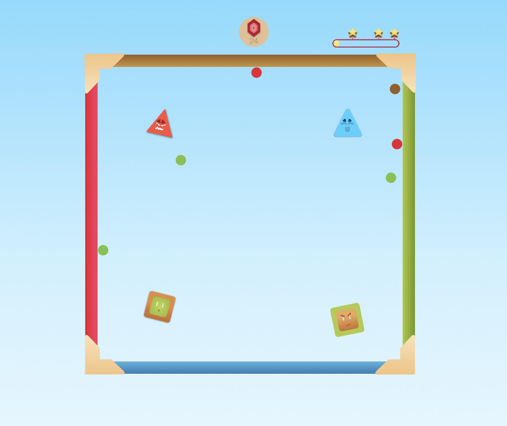

# WWDC19

The HappyGround is a game with focuses on children for the development of geolocation skills by means of a central bubble that must have against objects arranged on the screen in a random way for specific colors, the player must spray the ball in the opposite direction to be thrown and hit one of the walls to acquire one of the colors that she has and thus hit one of the objects with the proposed color, with that done, it gains points that define its position.

